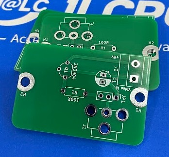
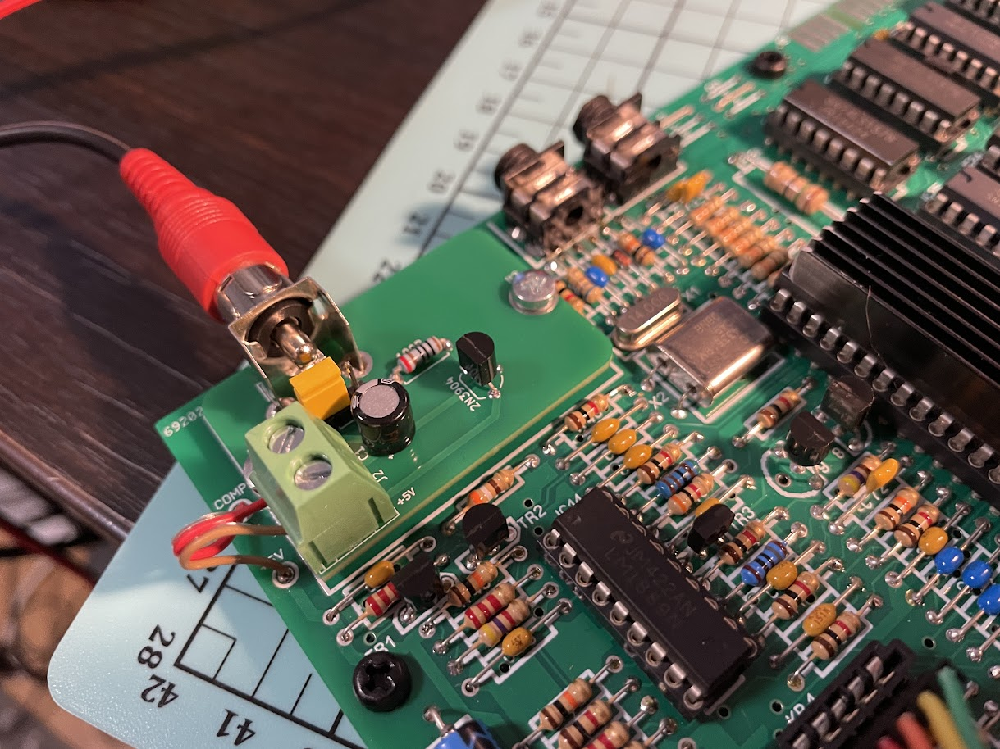

# ZX Spectrum Composite Mod PCB

This is a small replacement board for the original RF modulator found in the ZX Spectrum.
It provides a clean composite video output while keeping the installation simple and reversible.

Designed as a drop-in replacement for the RF can on the new boards. Keep in mind the original board don't have large holes for the screws to go in.
Minimal component count. Improved video quality compared to the stock RF output.

You can choose via a jumper to have output through the capacitor or through a transistor.

Inspiration from here: https://blog.retroleum.co.uk/electronics-articles/repairing-a-zx-spectrum/spectrum-video-mods/

Gerber files are available in the **AV-Adapter/production/** folder.
